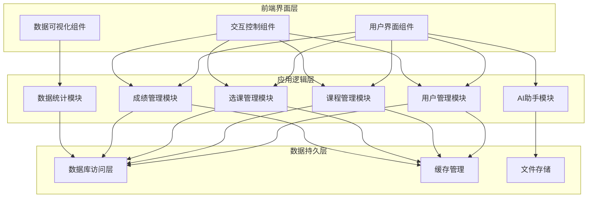
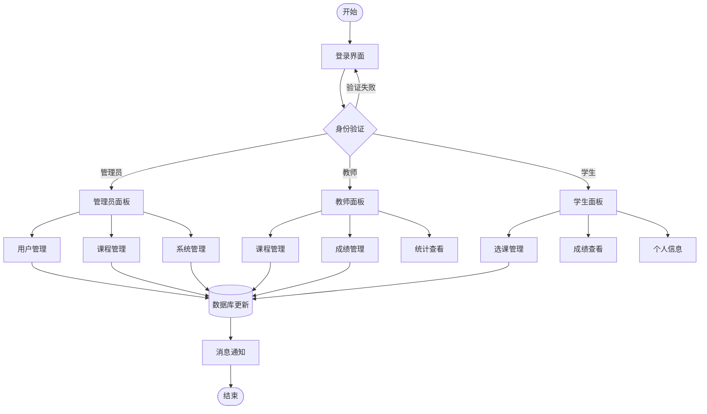
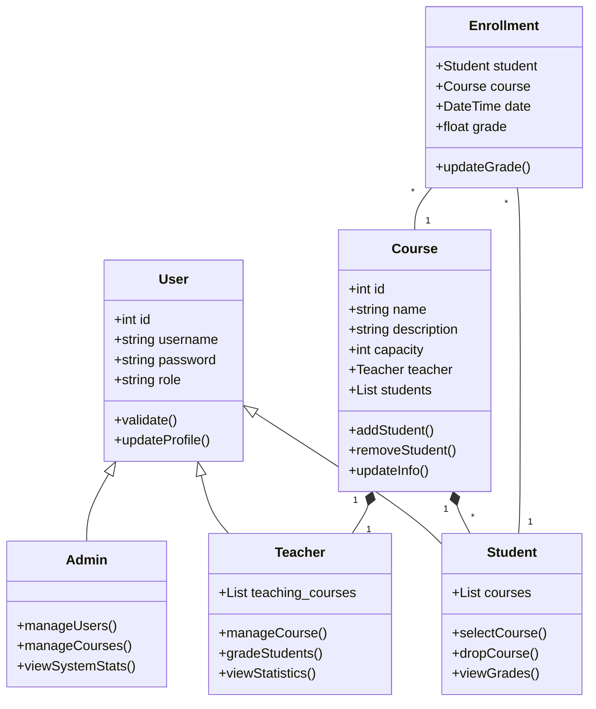
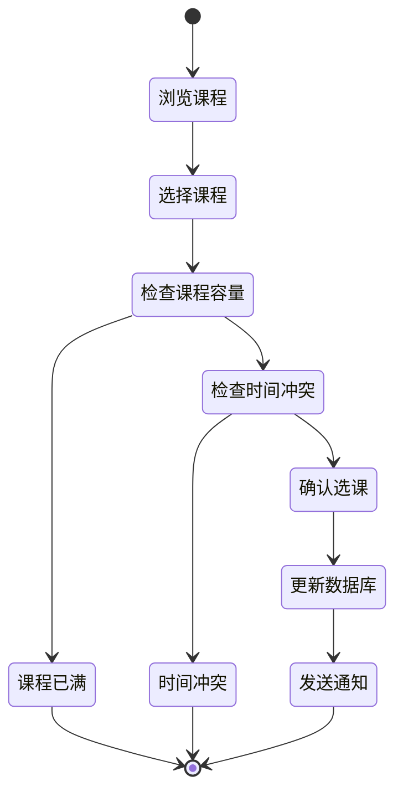
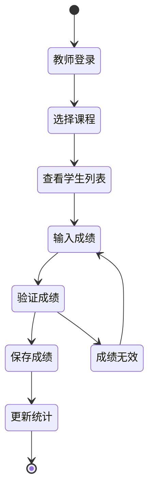
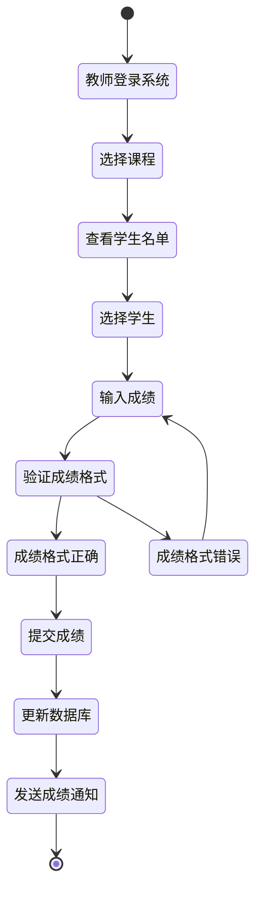
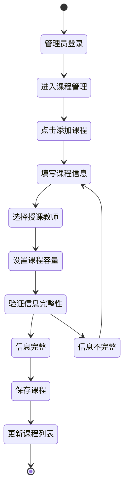
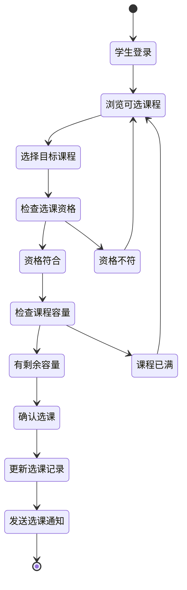
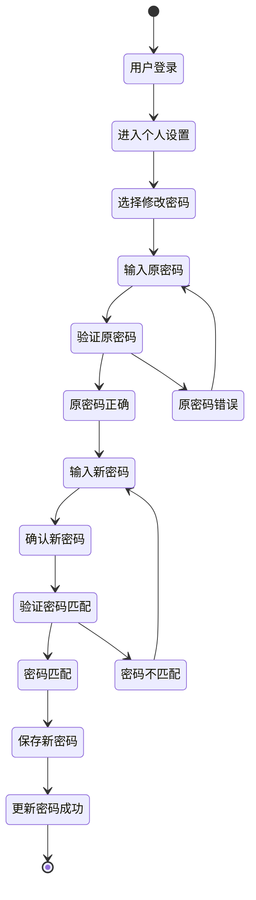

# 学生选课管理系统

一个基于Flask的现代化学生选课管理系统，具有响应式设计和实时数据可视化功能。

## 项目概述

本系统是一个完整的教育管理解决方案，为学生、教师和管理员提供不同的功能界面，实现课程管理、选课、成绩管理等功能。系统采用现代化的UI设计，支持深色模式，并提供实时数据统计和可视化功能。

## 总体设计

### 系统模块图



## 详细设计

### 1. 应用流程图



### 2. 系统类图



### 3. 选课活动图



### 4. 成绩管理活动图



### 5. 教师提交成绩流程图



### 6. 管理员添加课程流程图



### 7. 学生选修课程流程图



### 8. 用户密码修改流程图



## 技术栈

- **后端框架**: Flask
- **数据库**: SQLite + SQLAlchemy
- **前端框架**: Bootstrap 5
- **JavaScript库**: 
  - Chart.js (数据可视化)
  - Bootstrap Icons (图标)
- **CSS预处理**: 原生CSS变量
- **认证系统**: Flask-Login

## 系统架构

```
student_course_system/
├── instance/                 # 数据库文件目录
├── static/                   # 静态资源
│   ├── css/                 # CSS样式文件
│   └── js/                  # JavaScript文件
├── templates/               # HTML模板
├── app.py                   # 应用主文件
├── routes.py               # 路由定义
├── models.py               # 数据模型
└── utils/                  # 工具函数
```

## 核心功能

### 1. 用户管理
- 多角色支持（学生、教师、管理员）
- 用户认证和授权
- 个人信息管理

### 2. 课程管理
- 课程创建和编辑
- 课程容量控制
- 课程描述和学分管理

### 3. 选课系统
- 学生选课功能
- 课程查询和筛选
- 选课人数限制

### 4. 数据可视化
- 选课率统计
- 课程分布分析
- 实时数据更新

### 5. 界面特性
- 响应式设计
- 深色模式支持
- 实时数据刷新
- 侧边栏时钟组件
- AI助手聊天界面

## 用户角色和权限

### 管理员
- 用户管理（创建、编辑、删除）
- 课程管理（创建、编辑、删除）
- 系统监控和数据统计

### 教师
- 查看所教授的课程
- 管理课程信息
- 录入学生成绩

### 学生
- 浏览可选课程
- 进行选课操作
- 查看个人课表和成绩

## 数据可视化功能

系统提供多个数据可视化图表：

1. **选课人数占比环形图**
   - 显示已选课和未选课学生比例
   - 实时更新选课率

2. **课程注册分布饼图**
   - 展示各课程的选课人数分布
   - 直观显示热门课程

3. **选课趋势折线图**
   - 显示近期选课趋势
   - 帮助分析选课规律

4. **课程学分分布图**
   - 统计不同学分课程的数量
   - 辅助课程规划

## 特色功能

### 实时时钟面板
- 显示当前时间和日期
- 集成天气信息
- 优雅的滑动动画

### AI助手聊天界面
- 智能问答功能
- 实时消息历史
- 优雅的界面设计

## 安装和部署

1. 克隆项目并安装依赖：
```bash
git clone [项目地址]
cd student_course_system
pip install -r requirements.txt
```

2. 初始化数据库：
```bash
python init_db.py
```

3. 生成测试数据：
```bash
python generate_data.py
```

4. 运行应用：
```bash
python app.py
```

## 默认账户

- 管理员账户：
  - 用户名：Admin_蔡佳泽
  - 密码：admin123

- 教师账户：
  - 用户名：[教师姓名]教授
  - 密码：teacher123

- 学生账户：
  - 用户名：[学生姓名]同学
  - 密码：student123

## 开发团队

- 项目负责人：蔡佳泽
- 开发时间：2024年

## 更新日志

### Version 1.0.0 (2025.06)
- 初始版本发布
- 实现基础功能
- 添加数据可视化
- 集成AI助手功能

## 许可证

MIT License 

## 项目脚本说明

项目包含以下核心脚本文件：

### 1. 应用核心脚本

- **app.py**
  - 主应用文件
  - 包含Flask应用配置和初始化
  - 定义数据库模型和基本设置
  - 配置用户认证和会话管理

- **routes.py**
  - 路由定义文件
  - 包含所有API端点
  - 处理用户请求和响应
  - 实现业务逻辑

- **config.py**
  - 配置文件
  - 包含数据库连接设置
  - 定义应用密钥和其他配置项
  - 环境变量配置

### 2. 数据管理脚本

- **init_db.py**
  - 数据库初始化脚本
  - 创建数据库表结构
  - 初始化管理员账户
  - 设置基本数据

- **generate_data.py**
  - 测试数据生成脚本
  - 生成20个教师账户
  - 生成100个学生账户
  - 创建40门课程
  - 为80%的学生随机选课
  - 生成选课记录和课程分配

### 3. 功能模块脚本

- **weather.py**
  - 天气功能实现
  - 集成天气API
  - 提供实时天气数据
  - 用于时钟面板显示

### 4. 项目依赖

- **requirements.txt**
  - 项目依赖管理
  - 列出所有必要的Python包
  - 包含版本信息
  - 用于环境配置

## 数据初始化流程

要初始化系统数据，请按以下步骤操作：

1. 初始化数据库：
```bash
python init_db.py
```
- 创建数据库表结构
- 初始化管理员账户（用户名：Admin_蔡佳泽，密码：admin123）

2. 生成测试数据：
```bash
python generate_data.py
```
- 生成教师账户（20个，密码：teacher123）
- 生成学生账户（100个，密码：student123）
- 创建课程（40门）
- 生成选课数据（80%学生随机选课）

## 数据生成说明

### 教师数据
- 数量：20个
- 用户名格式：[随机姓氏] + "教授" + [随机数字]
- 默认密码：teacher123
- 随机分配课程

### 学生数据
- 数量：100个
- 用户名格式：[随机姓氏] + "同学" + [随机数字]
- 默认密码：student123
- 随机选择2-5门课程（80%的学生）

### 课程数据
- 数量：40门
- 名称格式：[学科] + [类型] + [级别]
- 学分：2.0-5.0随机分配
- 容量：30-150人随机设置
- 包含详细描述
- 记录选课人数

### 选课数据
- 覆盖80%的学生
- 每个学生2-5门课程
- 记录选课时间（近30天内随机）
- 自动更新课程已选人数 